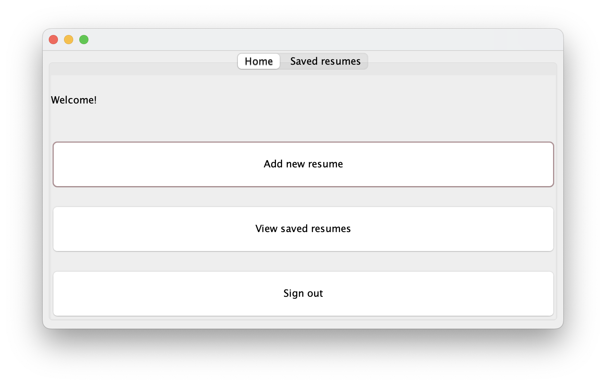
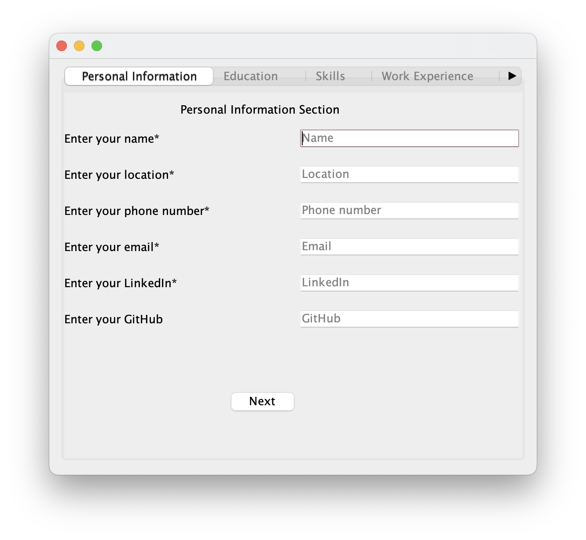
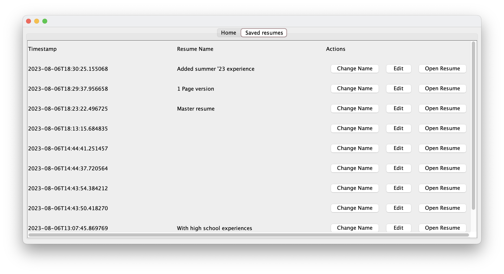
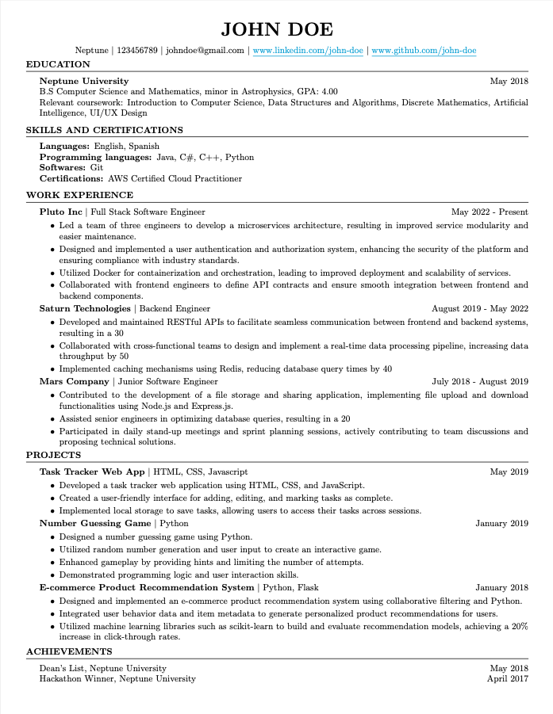

# ResumeBuilder

ResumeBuilder is a Java desktop application that allows users to enter their information in various fields, and the application will automatically generate a resume with all the information, in PDF format.

## Installation

Clone and enter into the directory
```sh
git clone https://github.com/eden-chung/ResumeBuilder.git
cd ResumeBuilder
```

Run the project
```sh
mvn clean compile exec:java
```

## Demos

After logging in with your username and password, you may view your resumes or create a new resume.




Accessing the SQLite database allows you to view your past resumes, add a name to them, and even edit it.



The program will automatically compile your information into a neatly formatted PDF file, from any of your previous saved resumes.

